## Web端说明

### 总体概述

本软件是为Team202开发的MR.Robot——基于启智ROS的智能服务型机器人服务的web端，运用flask及bootstrap框架进行开发，使用了python、html、css及javascript语言。此web端采用tcp连接方式与机器人主控端进行通信，通过socket编程与主控端进行消息的传递，从而使用户通过简单便捷的按键操作控制远程的机器人。

### 总体设计

本软件采用前后端分离的方式进行开发，前端通过js及ajex与后端进行交互。数据库使用了sqlite，对用户的信息和数据进行存储。本软件的总体设计及实现由王波文同学完成，莫策同学完成了用户数据库的设计和实现以及帮助文档的文案部分，曹博文同学完成了关于我们的文案部分。

### 页面设计

#### 登录页面

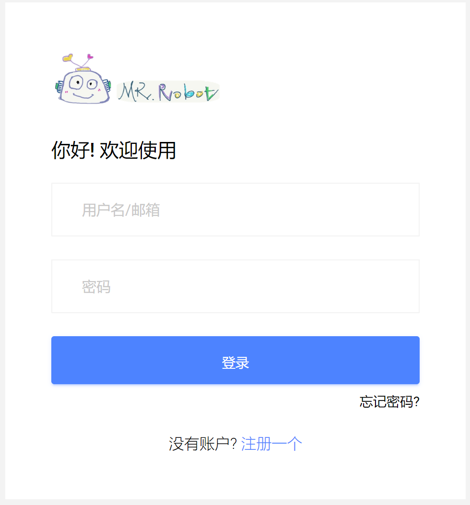

软件首先跳转到如上图的登录页面，若输入的用户名和密码与数据库中的相对应，则用户成功登录，跳转到首页；否则会如下图提醒用户邮箱或密码错误：

#### 注册页面

点击登录页面上的“注册一个”跳转到注册页面，如下图所示：

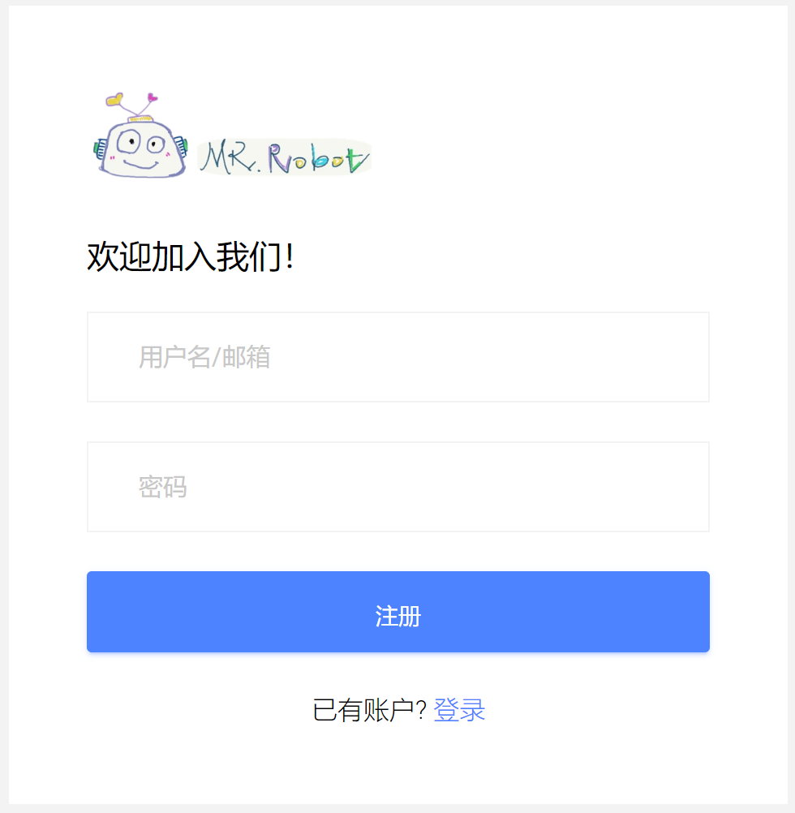

用户输入用户名及密码进行注册，若用户名不符合邮箱格式，则会如下图提醒用户：

若用户名或密码有空缺，则会如下图提醒用户：

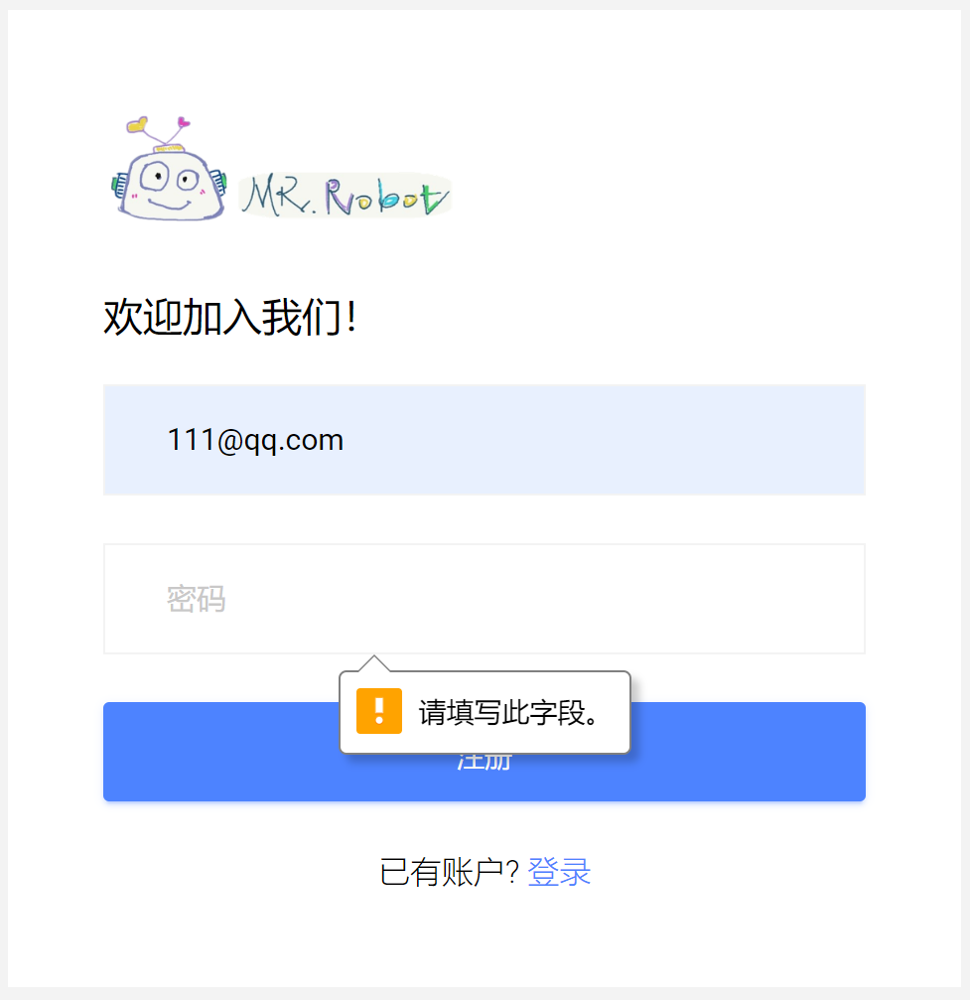

若用户名已被注册，则会如下图提醒用户：

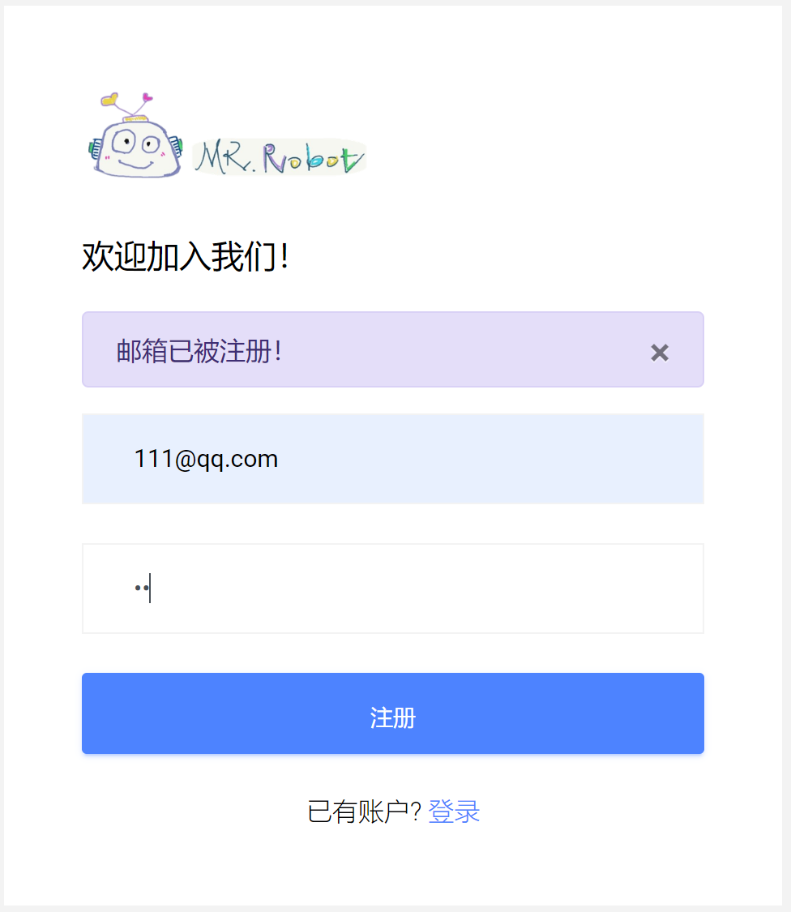

若无上述问题，则会如下图提醒用户注册成功并跳转至登录页面：

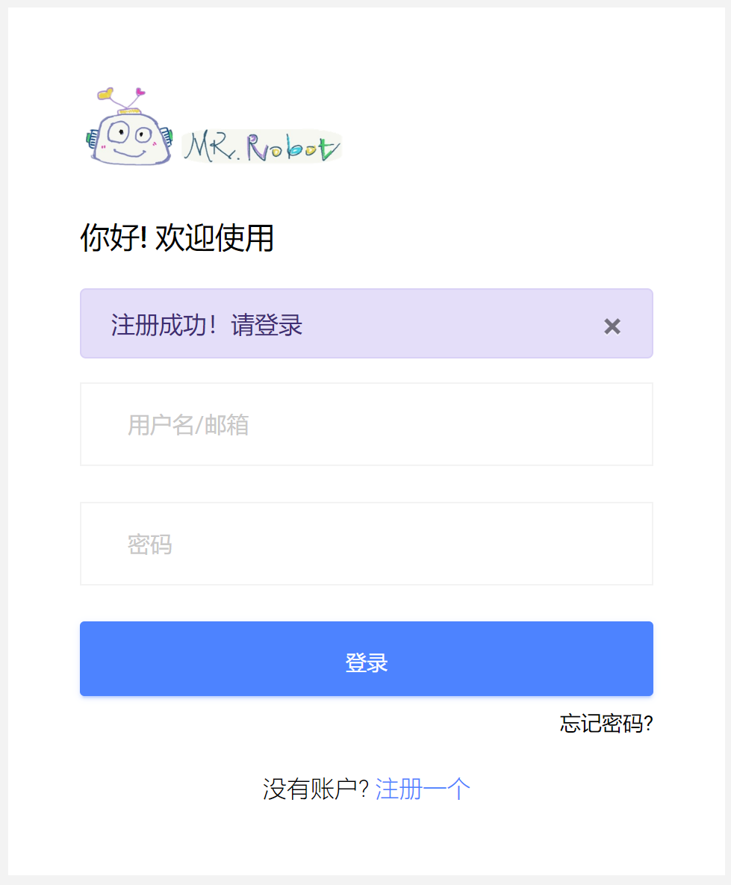

#### 首页

用户登录成功跳转至首页，包含了建图模式、基本移动模式、导航模式及抓取模式功能，页面如下图所示：

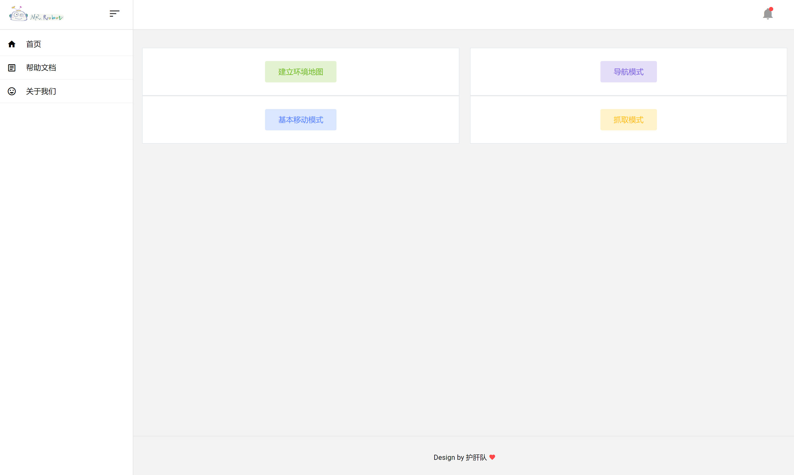

为了使页面简洁，四种功能界面采用弹窗形式，点击其中的按钮对机器人发出相应的指令：

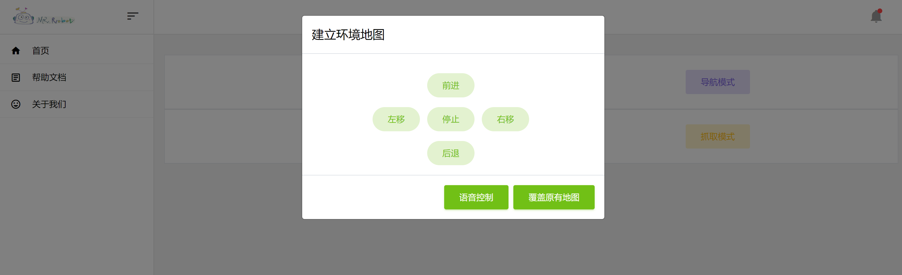

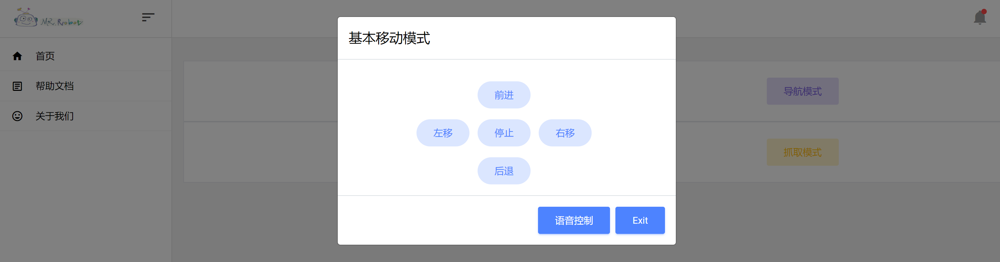

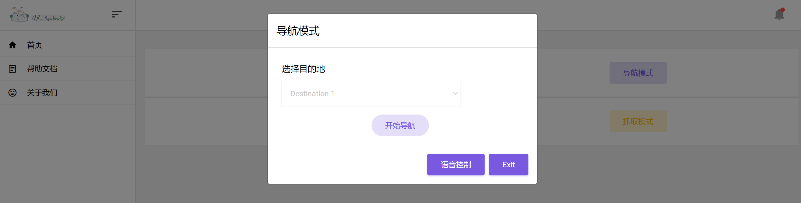

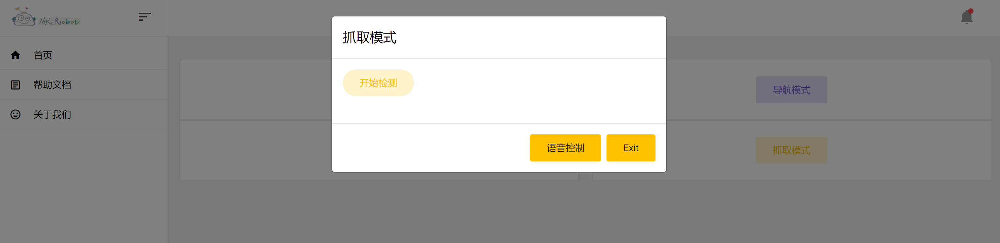

#### 帮助文档页面

本页面详细说明了软件的使用方法及功能，方便用户进行使用方法的查看：

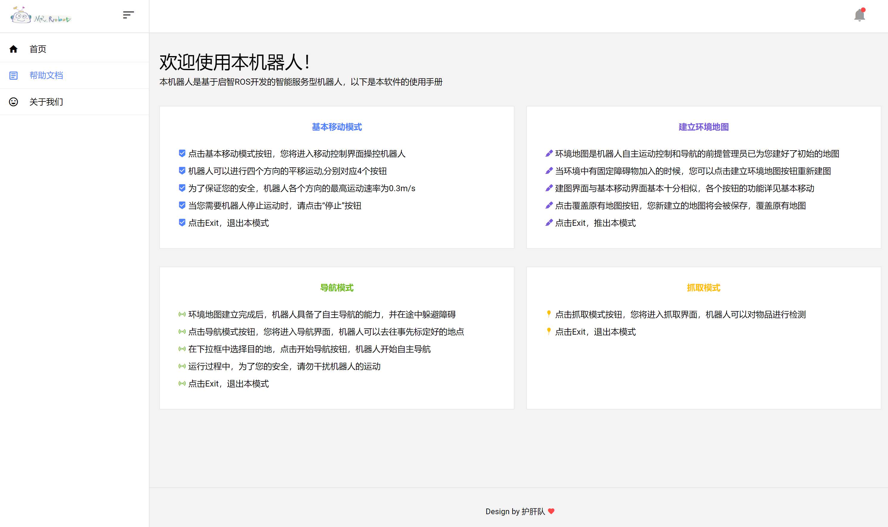

#### 关于我们页面

本页面介绍了团队情况及信息，便于用户了解及提供意见和建议：

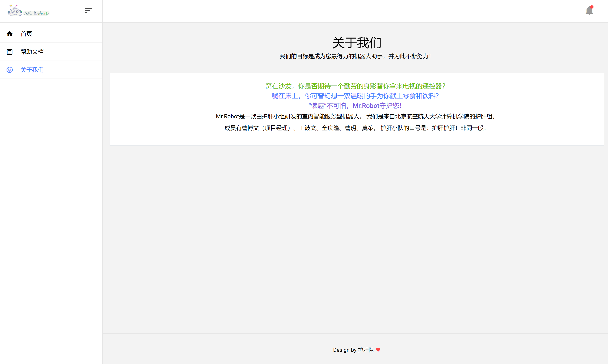

