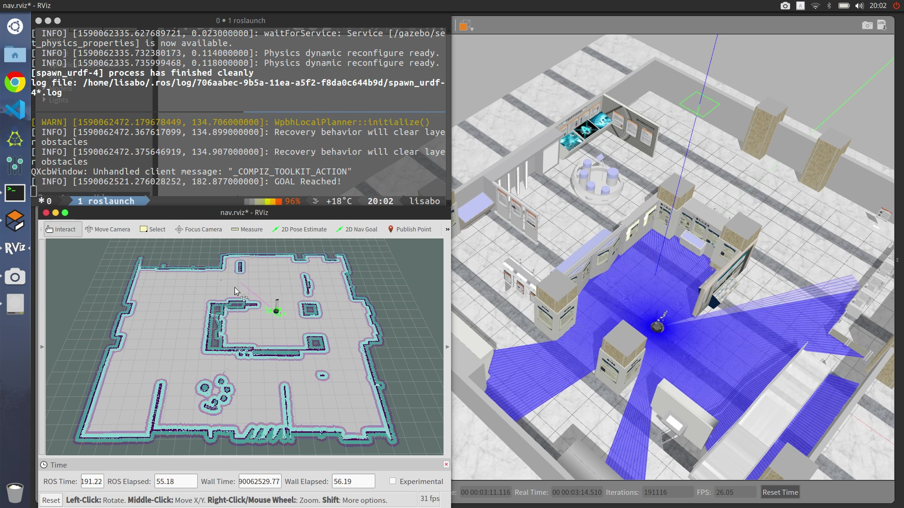
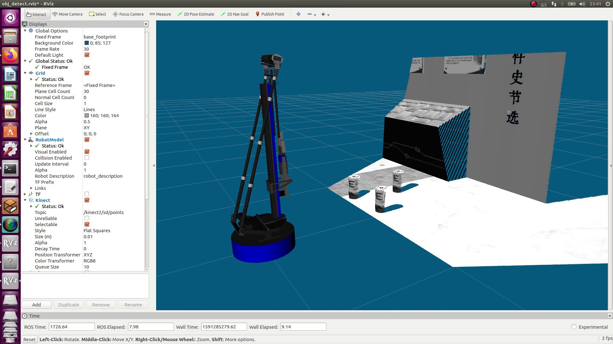

## 使用说明

### 安装方法

在本地新建一个文件夹（本说明用demo2_ws举例），在demo2_ws中再建一个src文件夹，将wpr_simulation，wpb_home和team202文件夹复制到其中，然后配置设备访问权限：

```
roscd wpb_home_bringup
cd scripts
chmod +x create_udev_rules.sh
./create_udev_rules.sh
```

使用以下命令进入并编译工作空间：

```
cd ~/demo2_ws
catkin_make
```


得到[100%]的反馈即为编译成功，发现 `~/demo2_ws` 目录下多出了 `build` 和 `devel` 文件夹。此时需要将 `demo2_ws` 刷新写入 `~/.bashrc`（或使用zsh的小伙伴需要写入`~/.zshrc`） 文件：

```
echo 'source ~/demo2_ws/devel/setup.bash' >> ~/.bashrc
（或 echo 'source ~/demo2_ws/devel/setup.zsh' >> ~/.zshrc）
```

### 启动Gazebo仿真环境（在使用其他功能前需先启用）

使用以下命令启动带有启智ROS机器人的仿真环境：

```
roslaunch wpr_simulation wpb_simple.launch
```


打开后的仿真环境如上图所示，滚动鼠标中键调整视野大小，按住鼠标中键旋转视角，可调整到如下图所示的视角，更加清晰的观察出机器人的动作。


### 使用仿真环境中的 `SLAM` 建图

分别在两个命令行窗口使用以下两条命令，启动 `SLAM` 建图以及启动键盘控制：

```
roslaunch team202 gmapping.launch
```

```
rosrun wpr_simulation keyboard_vel_ctrl
```


### 使用仿真环境中的定位导航

在命令行使用以下命令可开启导航界面：

```
roslaunch team202 navigation.launch
```



接着，首先在开启的导航界面中选择**2D Nav Goal**功能，而后在地图上选择导航目的地及机器人到达目的地后应面对的方向，便可看到机器人自主导航至目的地~

此外，若用户需要在地图上标记特殊点以便机器人在后续任务中仍能准确导航至该点，可使用**标点及顶点导航功能**。

### 在地图中加入标记航点并定点导航

#### 1.准备工作

若Ubuntu系统的用户名不是“Robot”，则需要在运行脚本之前修改add_way_point.launch文件中的航点文件路径。使用nano命令打开add_waypoint.launch文件：

```linux
nano ~/demo2_ws/src/waterplus_map_tools/launch/add_waypoint.launch
```

可以看到“Map tools”的节点脚本里有个“load”参数，表示的是航点文件保存的路径和文件名，默认是“/home/robot/waypoints.xml”，需要将“robot”替换为Ubuntu的账号名称，否则无法保存航点。

此外，还需要将waterplus_map_tools/src/nav.cpp的配置中的目录位置改为自己的用户名。

#### 2.添加航点

加点：

```
roslaunch waterplus_map_tools add_waypoint.launch
```

修改航点的名称：

```
nano waypoints.xml
```

保存点：

```
rosrun waterplus_map_tools wp_saver
```

#### 3.定点导航

分别在两个命令行窗口使用以下两条命令，启用导航功能并输入目标航点：

```
roslaunch team202 navigation.launch
```

```
rosrun team202 nav 1
```

其中，1为用户自定义的目标航点的名称。

### 使用仿真环境中的目标检测

在命令行窗口中使用以下命令

```
roslaunch team202 obj_recog.launch
```

即可看到机器人对面前物体的检测结果。



若要控制机器人移动以调整视野检测其他物体，可在另一个命令行中输入：

```
rosrun wpr_simulation keyboard_vel_ctrl
```

以控制机器人运动。

### 使用仿真环境中的目标抓取

在命令行窗口中使用以下命令，以启用抓取模块：

```
roslaunch team_202 grab_action.launch
```


而后可通过调节一旁的joint_state_publisher中的参数，控制机械臂升降、伸展，及机械手的开合。