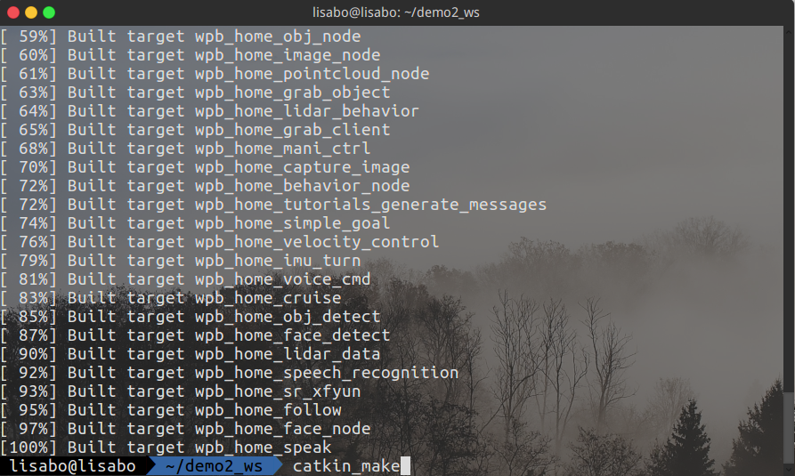
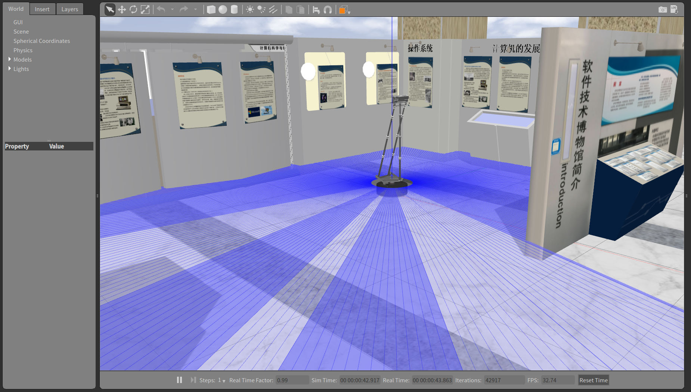
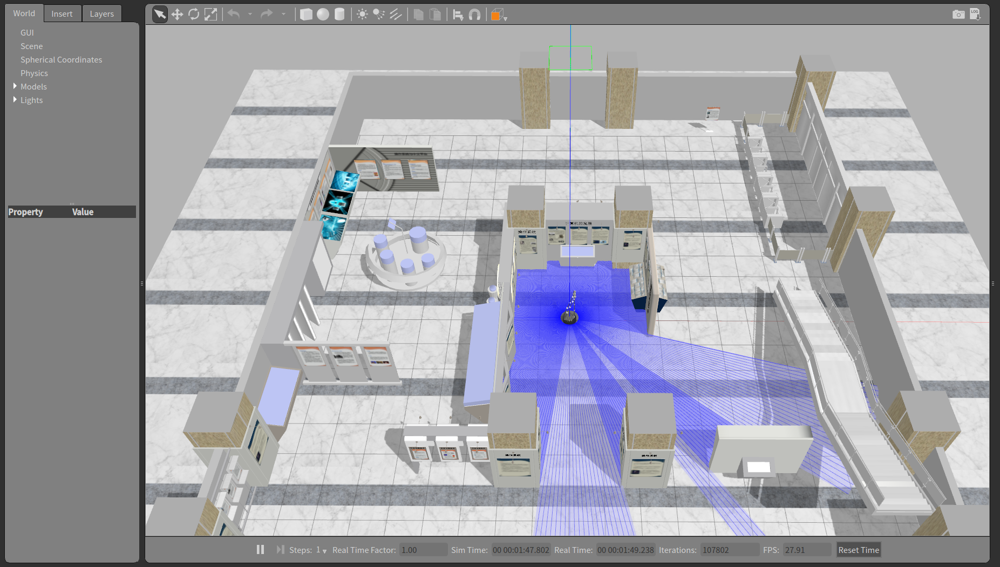

## 使用说明

### 安装方法

在本地新建一个文件夹（本说明用demo2_ws举例），在demo2_ws中再建一个src文件夹，将wpr_simulation与wpb_home文件夹复制到其中，使用以下命令进入并编译工作空间：

```
cd ~/demo2_ws
catkin_make
```



得到[100%]的反馈编即为译成功，发现 `~/demo2_ws` 目录下多出了 `build` 和 `devel` 文件夹。此时需要将 `demo2_ws` 刷新写入 `~/.bashrc`（或使用zsh的小伙伴需要写入`~/.zshrc`） 文件：

```
echo 'source ~/demo2_ws/devel/setup.bash' >> ~/.bashrc
（或 echo 'source ~/demo2_ws/devel/setup.zsh' >> ~/.zshrc）
```

### 启动Gazebo仿真环境（在使用其他功能前需先启用）

使用以下命令启动带有启智ROS机器人的仿真环境：

```
roslaunch wpr_simulation wpb_simple.launch
```



打开后的仿真环境如上图所示，滚动鼠标中键调整视野大小，按住鼠标中键旋转视角，可调整到如下图所示的视角，更加清晰的观察出机器人的动作。



### 使用仿真环境中的 `SLAM` 建图

分别在两个命令行窗口使用以下两条命令，启动 `SLAM` 建图以及启动键盘控制：

```
roslaunch wpr_simulation wpb_gmapping.launch
```

```
rosrun wpr_simulation keyboard_vel_ctrl
```


### 使用仿真环境中的定位导航

在命令行使用以下命令：

```
roslaunch wpr_simulation wpb_navigation.launch
```

